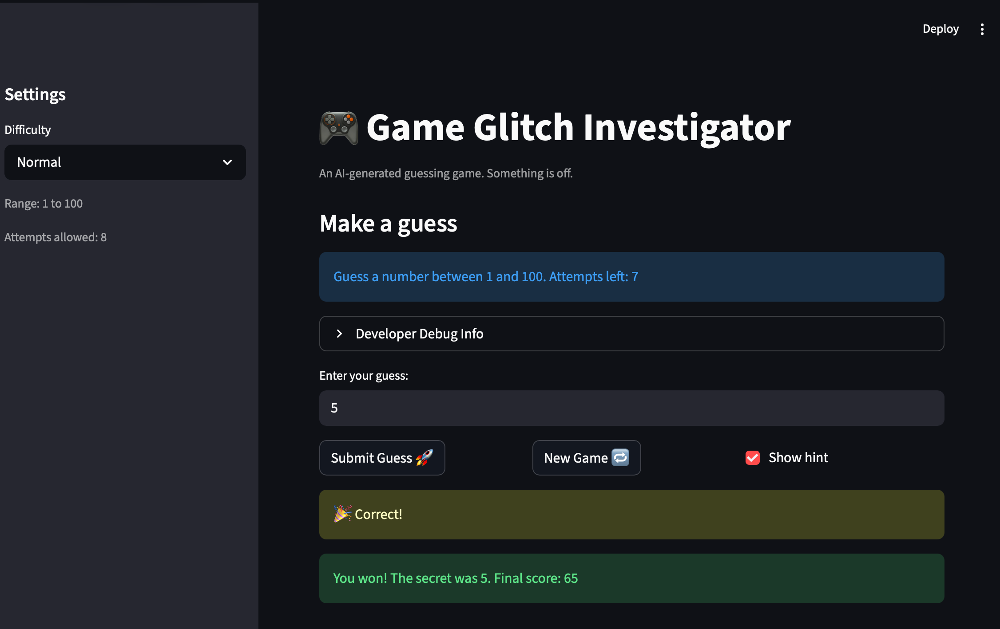

# 🎮 Game Glitch Investigator: The Impossible Guesser

## 🚨 The Situation

You asked an AI to build a simple "Number Guessing Game" using Streamlit.
It wrote the code, ran away, and now the game is unplayable. 

- You can't win.
- The hints lie to you.
- The secret number seems to have commitment issues.

## 🛠️ Setup
1. Install dependencies: `pip install -r requirements.txt`
2. Run the broken app: `python -m streamlit run app.py`

## 🕵️‍♂️ Your Mission

1. **Play the game.** Open the "Developer Debug Info" tab in the app to see the secret number. Try to win.
2. **Find the State Bug.** Why does the secret number change every time you click "Submit"? Ask ChatGPT: *"How do I keep a variable from resetting in Streamlit when I click a button?"*
3. **Fix the Logic.** The hints ("Higher/Lower") are wrong. Fix them.
4. **Refactor & Test.** - Move the logic into `logic_utils.py`.
   - Run `pytest` in your terminal.
   - Keep fixing until all tests pass!

## 📝 Document Your Experience

- [ ] Describe the game's purpose.
ANSWER: The game is a simple number guessing game where the player tries to guess a secret number between 1 and 100. After each guess, the game provides feedback on whether the guess is too high, too low, or correct. The player wins by guessing the correct number within a certain number of attempts.
- [ ] Detail which bugs you found.
ANSWER: The main bugs I found were:
1. The hint logic was incorrect, giving misleading feedback on whether to guess higher or lower.
2. The "New Game" button did not fully reset the game state, causing inconsistent behavior after restarting.
3. The attempts counter was initialized in a way that made the attempts-left feel off by one, which could confuse players about how many guesses they had remaining.
- [ ] Explain what fixes you applied.
ANSWER: To fix the bugs, I made the following changes:
1. I corrected the hint logic in the `check_guess` function to ensure that if the guess was greater than the secret number, it would return "Too High" and prompt the player to go lower, and if the guess was less than the secret number, it would return "Too Low" and prompt the player to go higher.
2. I updated the "New Game" button functionality to properly reset all relevant game state variables, ensuring that the game behaves consistently after a restart.
3. I initialized the attempts counter to 0 at the start of a new game, so that the attempts-left display would accurately reflect the number of guesses remaining without feeling off by one.  

## 📸 Demo

- [ ] [Insert a screenshot of your fixed, winning game here]
